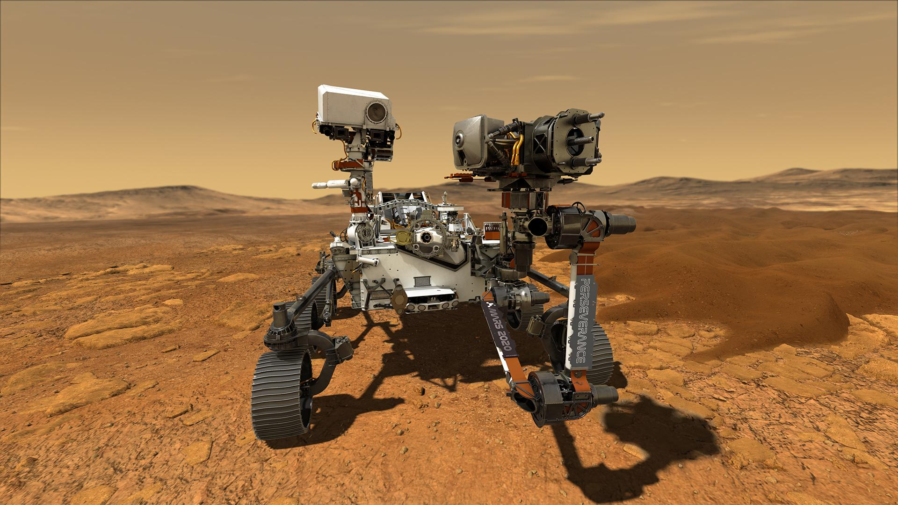
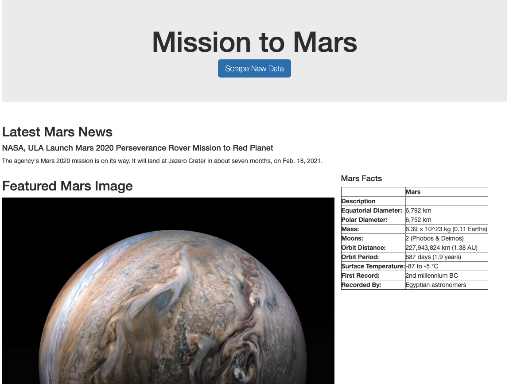
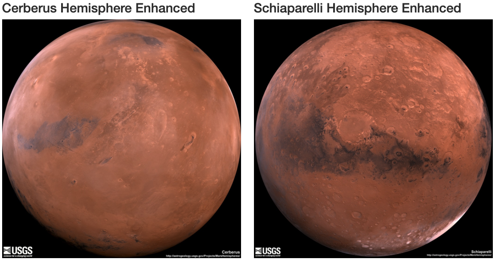
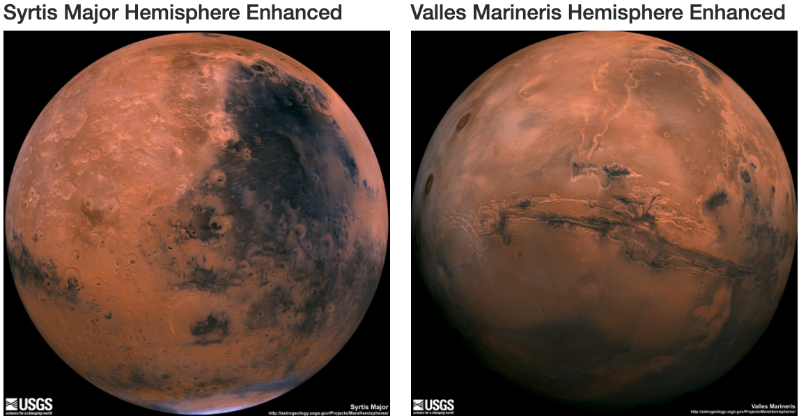

# Mission_to_Mars


Using Web Scrapping to gather data and store it using MongoDB and displaying it onto a Flask app

## Project Overview
Used Web Scraping tools such as Splinter and BeautifulSoup through Python and Jupyter Notebook to scrape data from several Mars NASA webpages. The data scraped was then displayed in a Flask webpage which was designed by HTML5. 

The challenge project adds another four images onto the Flask site from a different NASA webpage. Data is scraped to grab the images of the different Mars hemispheres

## Resources
- Data Sources: https://mars.nasa.gov/news/, https://www.jpl.nasa.gov/spaceimages/?search=&category=Mars, http://space-facts.com/mars/, https://astrogeology.usgs.gov/search/results?q=hemisphere+enhanced&k1=target&v1=Mars
- Software: Python 3.7.7, conda 4.7.12, ChromeDriver 84.0.4147.30, Splinter 0.13.0, BeautifulSoup 4.8.1, MongoDB 4.2, Bootstrap 4.0

## About This Project 

The project was to web scrape data from several NASA webpages. These webpages are scraping friendly, which is important when web scraping websites. The data that was grabbed from these websites were Mars articles, images, and a facts table. The data is first stored in a MongoDB database then transferred to a Flask webpage designed with HTML. 



The second section was to web scrape four new images from NASA Mars Hemisphere site. Each of the webpages for the hemisphere was scraped for the image and title which then be displayed onto the Flask app.





## Getting Started

This is the step by step guide to setup the environment and run the scraping tools on to the Flask app.

### Prerequisites

Download the required packages

* Splinter
```sh
pip install splinter
```

* ChromeDriver
For Windows
1. Download through the [webpage](https://sites.google.com/a/chromium.org/chromedriver/downloads)
2. Click the most updated link
3. Download the Windows file
4. Extract the excutable program file
5. Place it in the same folder as the Python Script

For macOS
* Using Homebrew
```sh
brew -v
```
```sh
brew install chromedriver
```
* If that doesn't work use cask install
```sh
brew cask install chromedriver
```
Verify download
```sh
chromedriver --version
```
* If Homebrew doesn't work then download from the [webpage](https://sites.google.com/a/chromium.org/chromedriver/downloads)

* BeautifulSoup
```sh
pip install beautifulsoup4
```

* MongoDB
[Windows Link](https://docs.mongodb.com/manual/tutorial/install-mongodb-on-windows/)
[macOS Link](https://docs.mongodb.com/manual/tutorial/install-mongodb-on-os-x/)

### Installation
1. Clone the repo
```sh
git clone https://github.com/chanhodchang/Mission_to_Mars.git
```
2. Access MongoDB database and create a mars_app database
```sh
use mars_app
```

3. Run app.py

4. Open the localhost (http://127.0.0.1:5000/)

5. Scrape the webpage!

## Analysis

Web Scraping is a powerful tool that can gather data from a website. It is especially useful when there is constant flow of new data. Webscraping can instantly gather the new data and update onto the desired databases. 